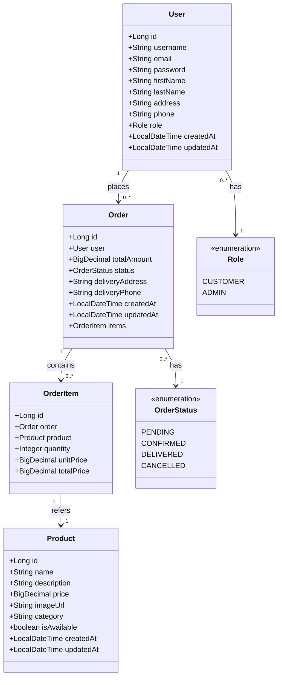

# Pizza Deliziosa - Full Stack Web Application

Pizza Deliziosa is a comprehensive web application for a pizza delivery service, built with Angular and Spring Boot. This project demonstrates a modern full-stack architecture implementing a RESTful API, authentication, e-commerce functionality, and responsive design.

## Table of Contents
- [System Architecture](#system-architecture)
- [Frontend Overview](#frontend-overview)
- [Backend Overview](#backend-overview)
- [Communication Flow](#communication-flow)
- [Authentication System](#authentication-system)
- [Data Models](#data-models)
- [Security Implementation](#security-implementation)
- [Deployment Architecture](#deployment-architecture)
- [Getting Started](#getting-started)
- [Development Workflow](#development-workflow)
- [Learning Resources](#learning-resources)

## System Architecture

The application follows a classic client-server architecture with a clear separation between frontend and backend:

```
┌─────────────────────┐                ┌─────────────────────┐
│                     │                │                     │
│    Angular          │                │    Spring Boot      │
│    Frontend         │◄──────REST─────┤    Backend          │
│                     │      API       │                     │
│                     │                │                     │
└─────────────────────┘                └─────────────────────┘
         │                                       │
         │                                       │
         ▼                                       ▼
┌─────────────────────┐                ┌─────────────────────┐
│                     │                │                     │
│     NGINX           │                │    PostgreSQL       │
│     Web Server      │                │    Database         │
│                     │                │                     │
└─────────────────────┘                └─────────────────────┘
```


## Frontend Overview

The frontend is an Angular Single Page Application (SPA) with a modular architecture:

### Core Architecture
- **Angular Framework**: Powers the frontend with component-based architecture
- **TypeScript**: Provides type safety and modern language features
- **RxJS**: Handles asynchronous operations and reactive programming
- **Angular Router**: Manages navigation and route protection
- **Angular HttpClient**: Communicates with the backend API

### Key Features
- Responsive design that works on mobile and desktop
- User authentication (login/registration)
- Product browsing and filtering
- Shopping cart functionality
- Checkout process with order management
- Admin interface for product and order management
- Profile management for users

See the [Frontend README](frontend/README.md) for detailed documentation.

## Backend Overview

The backend is a Spring Boot application that provides a RESTful API:

### Core Architecture
- **Spring Boot**: Main framework for backend development
- **Spring Data JPA**: Data access layer with Hibernate as the ORM
- **Spring Security**: Authentication and authorization
- **PostgreSQL**: Relational database for data persistence
- **JWT**: Stateless authentication mechanism

### Key Features
- RESTful API endpoints
- JWT-based authentication
- Role-based authorization
- Database persistence with JPA
- CORS configuration for frontend integration

See the [Backend README](backend/README.md) for detailed documentation.

## Communication Flow

The frontend and backend communicate through RESTful API calls:

1. **HTTP Methods**: The application uses standard HTTP methods for CRUD operations:
   - GET: Retrieve resources
   - POST: Create new resources
   - PUT: Update existing resources
   - DELETE: Remove resources

2. **Data Format**: All API communication uses JSON as the data exchange format

3. **API Endpoints**: Organized by resource type:
   - `/api/auth/*`: Authentication endpoints
   - `/api/products/*`: Product management
   - `/api/orders/*`: Order processing
   - `/api/users/*`: User management

4. **Request Flow Example**:
   ```
   ┌──────────┐        ┌────────┐        ┌───────────┐       ┌──────────┐
   │  Angular │        │  NGINX │        │  Spring   │       │PostgreSQL│
   │  Client  │        │ Server │        │   Boot    │       │ Database │
   └────┬─────┘        └───┬────┘        └─────┬─────┘       └────┬─────┘
        │                  │                    │                  │
        │  GET /products   │                    │                  │
        │─────────────────>│                    │                  │
        │                  │  GET /api/products │                  │
        │                  │───────────────────>│                  │
        │                  │                    │  SELECT * FROM   │
        │                  │                    │  products        │
        │                  │                    │─────────────────>│
        │                  │                    │                  │
        │                  │                    │   Results        │
        │                  │                    │<─────────────────│
        │                  │   JSON Response    │                  │
        │                  │<───────────────────│                  │
        │   JSON Response  │                    │                  │
        │<─────────────────│                    │                  │
        │                  │                    │                  │
   ```

## Authentication System

The application uses JWT (JSON Web Tokens) for secure, stateless authentication:

### Authentication Flow

1. **Login Process**:
   ```
   ┌──────────┐                      ┌───────────┐
   │  Angular │                      │  Spring   │
   │  Client  │                      │   Boot    │
   └────┬─────┘                      └─────┬─────┘
        │                                  │
        │ POST /api/auth/login             │
        │ {username, password}             │
        │─────────────────────────────────>│
        │                                  │ Validate credentials
        │                                  │ Generate JWT
        │                                  │
        │ 200 OK                           │
        │ {token, user_data}               │
        │<─────────────────────────────────│
        │                                  │
        │ Store token in localStorage      │
        │                                  │
   ```

2. **Authenticated Requests**:
   ```
   ┌──────────┐                      ┌───────────┐
   │  Angular │                      │  Spring   │
   │  Client  │                      │   Boot    │
   └────┬─────┘                      └─────┬─────┘
        │                                  │
        │ GET /api/orders                  │
        │ Authorization: Bearer {token}    │
        │─────────────────────────────────>│
        │                                  │ Validate token
        │                                  │ Check permissions
        │                                  │ Process request
        │                                  │
        │ 200 OK                           │
        │ {order_data}                     │
        │<─────────────────────────────────│
        │                                  │
   ```

### JWT Implementation

The JWT tokens contain:
- **Header**: Token type and hashing algorithm
- **Payload**: User ID, username, roles, and expiration time
- **Signature**: Verifies token integrity

The `JwtUtil` class in the backend handles:
- Token generation
- Token validation
- Extracting user information

## Data Models

The core data models in the application:



## Security Implementation

### Backend Security

The Spring Security configuration:

1. **JWT Filter Chain**: Intercepts requests to validate JWT tokens
2. **CORS Configuration**: Controls which origins can access the API
3. **Authorization Rules**: Defines access rules for different endpoints
4. **Password Encryption**: Uses bcrypt for secure password storage

### Frontend Security

The Angular application implements:

1. **JWT Interceptor**: Automatically adds JWT tokens to outgoing requests
2. **Route Guards**: Prevents unauthorized access to protected routes
3. **Error Handling**: Intercepts and processes authentication errors
4. **XSS Protection**: Angular's built-in sanitization prevents cross-site scripting

## Deployment Architecture

The application uses Docker for containerized deployment:

```
┌───────────────────────────────────────────────────────┐
│                      Docker Network                    │
│                                                        │
│   ┌──────────────┐     ┌──────────────┐                │
│   │              │     │              │                │
│   │    NGINX     │     │  Spring Boot │                │
│   │   Container  │────>│   Container  │                │
│   │              │     │              │                │
│   └──────────────┘     └──────────────┘                │
│          │                     │                       │
│          │                     │                       │
│          │                     │                       │
│          │               ┌─────v──────┐                │
│          │               │            │                │
│          └─────────────<─│ PostgreSQL │                │
│                          │ Container  │                │
│                          │            │                │
│                          └────────────┘                │
│                                                        │
└───────────────────────────────────────────────────────┘
```

### NGINX as Reverse Proxy

NGINX serves the frontend and routes API requests to the backend:

1. **Static Content**: Serves the compiled Angular application
2. **API Proxy**: Forwards `/api/*` requests to the Spring Boot backend
3. **Single Page Application Support**: Routes all non-file URLs to index.html

Example NGINX configuration:
```nginx
server {
    listen 80;
    root /usr/share/nginx/html;
    index index.html;
    
    # API requests proxy to backend
    location /api/ {
        proxy_pass http://backend:8080/api/;
        proxy_set_header Host $host;
        proxy_set_header X-Real-IP $remote_addr;
    }
    
    # All other routes serve Angular application
    location / {
        try_files $uri $uri/ /index.html;
    }
}
```

## Getting Started

### Prerequisites
- Docker and Docker Compose
- Node.js and npm (for frontend development)
- Java JDK 11+ (for backend development)

### Quick Start

1. **Clone the repository**:
   ```
   git clone https://github.com/yourusername/pizza-deliziosa.git
   cd pizza-deliziosa
   ```

2. **Start the application with Docker Compose**:
   ```
   docker-compose up -d
   ```

3. **Access the application**:
   ```
   Frontend: http://localhost
   Backend API: http://localhost/api
   ```

## Development Workflow

### Backend Development

1. Navigate to the backend directory:
   ```
   cd backend
   ```

2. Run the Spring Boot application:
   ```
   ./mvnw spring-boot:run
   ```

3. The API will be available at http://localhost:8080

### Frontend Development

1. Navigate to the frontend directory:
   ```
   cd frontend
   ```

2. Install dependencies:
   ```
   npm install
   ```

3. Start the development server:
   ```
   ng serve
   ```

4. The application will be available at http://localhost:4200

## Learning Resources

For beginners learning REST application development:

### Angular Resources
- [Angular Official Documentation](https://angular.io/docs)
- [Angular HTTP Client](https://angular.io/guide/http)
- [Angular Routing](https://angular.io/guide/router)
- [RxJS for Angular](https://angular.io/guide/rx-library)

### Spring Boot Resources
- [Spring Boot Documentation](https://docs.spring.io/spring-boot/docs/current/reference/html/)
- [Spring Data JPA](https://docs.spring.io/spring-data/jpa/docs/current/reference/html/)
- [Spring Security](https://docs.spring.io/spring-security/reference/index.html)
- [JWT Authentication](https://jwt.io/introduction/)

### RESTful API Design
- [REST API Best Practices](https://restfulapi.net/)
- [Richardson Maturity Model](https://martinfowler.com/articles/richardsonMaturityModel.html)
- [HTTP Status Codes](https://httpstatuses.com/)

### Docker and Deployment
- [Docker Documentation](https://docs.docker.com/)
- [NGINX Documentation](https://nginx.org/en/docs/)
- [Docker Compose](https://docs.docker.com/compose/)
