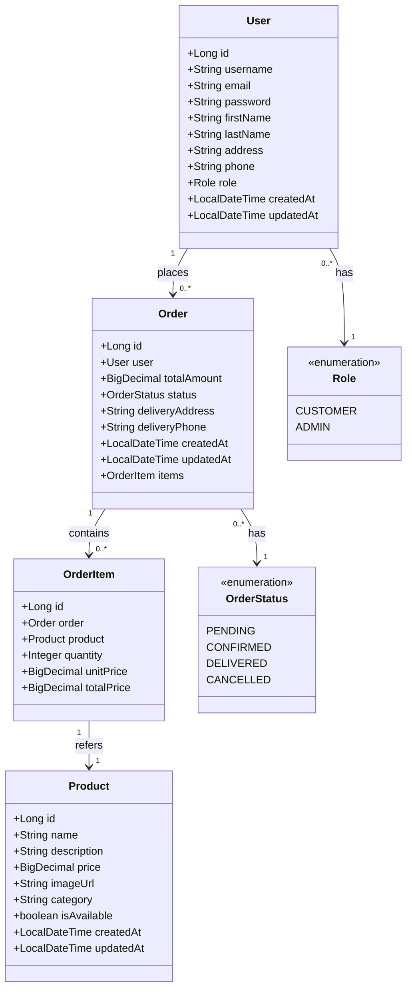

# Pizza Deliziosa - Full Stack Web Application

Pizza Deliziosa is a comprehensive web application for a pizza delivery service, built with Angular and Spring Boot. This project demonstrates a modern full-stack architecture implementing RESTful API patterns, JWT authentication, e-commerce functionality, and responsive design.

## Table of Contents
- [System Architecture](#system-architecture)
- [Frontend Overview](#frontend-overview)
- [Backend Overview](#backend-overview)
- [Communication Flow](#communication-flow)
- [Authentication System](#authentication-system)
- [Data Models](#data-models)
- [Security Implementation](#security-implementation)
- [Deployment Architecture](#deployment-architecture)
- [Getting Started](#getting-started)
- [Development Workflow](#development-workflow)
- [Learning Resources](#learning-resources)

## System Architecture

The application follows a classic client-server architecture with a clear separation between frontend and backend components. This separation of concerns allows for independent development and deployment of each component.

### High-Level Architecture Diagram

```
┌─────────────────────┐                ┌─────────────────────┐
│                     │                │                     │
│    Angular          │                │    Spring Boot      │
│    Frontend         │◄──────REST─────┤    Backend          │
│                     │      API       │                     │
│                     │                │                     │
└─────────────────────┘                └─────────────────────┘
         │                                       │
         │                                       │
         ▼                                       ▼
┌─────────────────────┐                ┌─────────────────────┐
│                     │                │                     │
│     NGINX           │                │    PostgreSQL       │
│     Web Server      │                │    Database         │
│                     │                │                     │
└─────────────────────┘                └─────────────────────┘
```

### Architectural Components

1. **Angular Frontend**: Single-page application (SPA) built with Angular 14+
   - Located in [`frontend/`](frontend/) directory
   - Uses TypeScript, RxJS, and Angular Material
   - Communicates with backend via HTTP requests using `HttpClient`

2. **Spring Boot Backend**: RESTful API service built with Spring Boot 2.7.x
   - Located in [`backend/`](backend/) directory
   - Uses Spring Web, Spring Data JPA, Spring Security
   - Exposes REST endpoints for CRUD operations

3. **NGINX Web Server**: Serves the Angular application and proxies API requests
   - Configuration in [`frontend/nginx.conf`](frontend/nginx.conf)
   - Acts as a reverse proxy for backend API calls

4. **PostgreSQL Database**: Persists application data
   - Schema defined by JPA entities in [`backend/src/main/java/com/pizza/model/`](backend/src/main/java/com/pizza/model/)
   - Connected via Spring Data JPA repositories

### Key Design Patterns

The application architecture implements several important design patterns:

1. **Model-View-Controller (MVC)**: 
   - Spring Boot controllers handle HTTP requests and responses
   - Angular components act as views
   - Models are shared between frontend (TypeScript interfaces) and backend (JPA entities)

2. **Repository Pattern**:
   - Spring Data JPA repositories provide data access abstractions
   - Example: [`UserRepository.java`](backend/src/main/java/com/pizza/repository/UserRepository.java)

3. **Dependency Injection**:
   - Used extensively in both Angular (services) and Spring Boot (components)
   - Promotes testability and decoupling

4. **Observer Pattern**:
   - Implemented with RxJS Observables in Angular for reactive programming
   - Example: Auth state management in [`auth.service.ts`](frontend/src/app/core/services/auth.service.ts)

### Component Diagram

```mermaid
classDiagram
    class AuthController {
        +login(AuthRequestDto request) AuthResponseDto
        +register(RegisterRequestDto request) ResponseEntity
    }
    
    class HomeController {
        +index() String
        +about() String
    }
    
    class ProductController {
        +getAllProducts() List~Product~
        +getProduct(Long id) Product
        +createProduct(Product product) Product
        +updateProduct(Long id, Product product) Product
        +deleteProduct(Long id) void
    }
    
    class OrderController {
        +getAllOrders() List~Order~
        +getOrder(Long id) Order
        +createOrder(Order order) Order
        +updateOrderStatus(Long id, String status) Order
    }
    
    class UserController {
        +getAllUsers() List~User~
        +getUser(Long id) User
        +updateUser(Long id, User user) User
    }
    
    class MessageController {
        +getAllMessages() List~Message~
        +createMessage(Message message) Message
    }
    
    class JpaRepository~T,ID~ {
        <<interface>>
        +findAll() List~T~
        +findById(ID id) Optional~T~
        +save(T entity) T
        +delete(T entity) void
        +count() long
    }
    
    class UserRepository {
        <<interface>>
        +findByUsername(String username) Optional~User~
        +findByEmail(String email) Optional~User~
        +existsByUsername(String username) boolean
    }
    
    class ProductRepository {
        <<interface>>
        +findByAvailable(boolean available) List~Product~
        +findByNameContaining(String name) List~Product~
    }
    
    class OrderRepository {
        <<interface>>
        +findByUser(User user) List~Order~
        +findByStatus(String status) List~Order~
    }
    
    class MessageRepository {
        <<interface>>
        +findBySender(User sender) List~Message~
        +findByTimestampAfter(LocalDateTime timestamp) List~Message~
    }
    
    class JwtUtil {
        +generateToken(UserDetails userDetails) String
        +extractUsername(String token) String
        +validateToken(String token, UserDetails userDetails) boolean
    }
    
    AuthController --> UserRepository : uses
    AuthController --> JwtUtil : uses
    ProductController --> ProductRepository : uses
    OrderController --> OrderRepository : uses
    UserController --> UserRepository : uses
    MessageController --> MessageRepository : uses
    
    JpaRepository <|-- UserRepository : extends
    JpaRepository <|-- ProductRepository : extends
    JpaRepository <|-- OrderRepository : extends
    JpaRepository <|-- MessageRepository : extends
```



For further technical details on each component:
- See the [Frontend README](frontend/README.md) for detailed Angular architecture
- See the [Backend README](backend/README.md) for detailed Spring Boot architecture

## Frontend Overview

The frontend is an Angular Single Page Application (SPA) with a modular architecture that follows the [Angular Style Guide](https://angular.io/guide/styleguide) recommendations.

### Core Architecture

- **[Angular Framework](https://angular.io/)**: Powers the frontend with component-based architecture
  - Version 14+ with TypeScript support
  - Root module: [`app.module.ts`](frontend/src/app/app.module.ts)
  - Bootstrap process begins in [`main.ts`](frontend/src/app/main.ts)

- **[TypeScript](https://www.typescriptlang.org/)**: Provides type safety and modern language features
  - Configuration in [`tsconfig.json`](frontend/tsconfig.json)
  - Type definitions for all models in [`frontend/src/app/core/models/`](frontend/src/app/core/models/)

- **[RxJS](https://rxjs.dev/)**: Handles asynchronous operations and reactive programming
  - Used in services for HTTP requests and state management
  - Example: Observable streams in [`auth.service.ts`](frontend/src/app/core/services/auth.service.ts)

- **[Angular Router](https://angular.io/guide/router)**: Manages navigation and route protection
  - Route configuration in [`app-routing.module.ts`](frontend/src/app/app-routing.module.ts)
  - Guards for protected routes: [`auth.guard.ts`](frontend/src/app/core/guards/auth.guard.ts)

- **[Angular HttpClient](https://angular.io/guide/http)**: Communicates with the backend API
  - HTTP interceptors for authentication: [`jwt.interceptor.ts`](frontend/src/app/core/interceptors/jwt.interceptor.ts)
  - REST API calls in service classes: [`product.service.ts`](frontend/src/app/core/services/product.service.ts)

### Key Features

- **Responsive design** that works on mobile and desktop devices using flexbox and grid layouts
- **User authentication** with JWT tokens handled by [`auth.service.ts`](frontend/src/app/core/services/auth.service.ts)
- **Product browsing and filtering** with reactive forms for search
- **Shopping cart functionality** managed by [`cart.service.ts`](frontend/src/app/core/services/cart.service.ts)
- **Checkout process** with multi-step form implementation
- **Admin interface** with protected routes for product and order management
- **Profile management** for users to update their information

### Modular Structure

The application is organized into three main types of modules:

1. **Core Module**: Singleton services and models (`frontend/src/app/core/`)
2. **Feature Modules**: Specific functional areas (`frontend/src/app/features/`)
3. **Shared Module**: Reusable components (`frontend/src/app/shared/`)

See the [Frontend README](frontend/README.md) for detailed documentation.

## Backend Overview

The backend is a Spring Boot application that provides a RESTful API following best practices for a layered architecture.

### Core Architecture

- **[Spring Boot](https://spring.io/projects/spring-boot)**: Main framework for backend development
  - Version 2.7.x with Java 11+
  - Application entry point: [`PizzaWebshopApplication.java`](backend/src/main/java/com/pizza/PizzaWebshopApplication.java)
  - Auto-configuration and dependency injection

- **[Spring Data JPA](https://spring.io/projects/spring-data-jpa)**: Data access layer with Hibernate as the ORM
  - Repository interfaces: [`backend/src/main/java/com/pizza/repository/`](backend/src/main/java/com/pizza/repository/)
  - Entity classes: [`backend/src/main/java/com/pizza/model/`](backend/src/main/java/com/pizza/model/)

- **[Spring Security](https://spring.io/projects/spring-security)**: Authentication and authorization
  - Security configuration: [`SecurityConfig.java`](backend/src/main/java/com/pizza/config/SecurityConfig.java)
  - JWT implementation: [`JwtUtil.java`](backend/src/main/java/com/pizza/security/JwtUtil.java)

- **[PostgreSQL](https://www.postgresql.org/)**: Relational database for data persistence
  - Connected via Spring Data JPA
  - Configuration in `application.properties`

- **[JWT](https://jwt.io/)**: Stateless authentication mechanism
  - Token generation and validation in [`JwtUtil.java`](backend/src/main/java/com/pizza/security/JwtUtil.java)
  - Token filtering in [`JwtRequestFilter.java`](backend/src/main/java/com/pizza/security/JwtRequestFilter.java)

### Key Features

- **RESTful API endpoints** defined in controller classes
  - Example: [`ProductController.java`](backend/src/main/java/com/pizza/controller/ProductController.java)

- **JWT-based authentication** in [`AuthController.java`](backend/src/main/java/com/pizza/controller/AuthController.java)
  ```java
  @PostMapping("/login")
  public ResponseEntity<?> login(@RequestBody AuthRequestDto authRequest) {
      Authentication authentication = authenticationManager.authenticate(
              new UsernamePasswordAuthenticationToken(
                      authRequest.getUsername(), 
                      authRequest.getPassword()
              )
      );
      
      final UserDetails userDetails = userDetailsService.loadUserByUsername(authRequest.getUsername());
      final String jwt = jwtUtil.generateToken(userDetails);
      
      // Return token and user information
  }
  ```

- **Role-based authorization** using Spring Security annotations
  ```java
  @PreAuthorize("hasRole('ADMIN')")
  @GetMapping("/admin/users")
  public List<User> getAllUsers() {
      return userRepository.findAll();
  }
  ```

- **Database persistence with JPA** for object-relational mapping
  ```java
  @Entity
  @Table(name = "products")
  public class Product {
      @Id
      @GeneratedValue(strategy = GenerationType.IDENTITY)
      private Long id;
      
      private String name;
      private String description;
      private BigDecimal price;
      // Additional fields...
  }
  ```

- **CORS configuration** for secure cross-origin requests
  ```java
  @Bean
  public CorsConfigurationSource corsConfigurationSource() {
      CorsConfiguration configuration = new CorsConfiguration();
      configuration.setAllowedOrigins(Arrays.asList("http://localhost:4200"));
      configuration.setAllowedMethods(Arrays.asList("GET", "POST", "PUT", "DELETE"));
      configuration.setAllowedHeaders(Arrays.asList("Authorization", "Content-Type"));
      // Additional configuration...
      return source;
  }
  ```

See the [Backend README](backend/README.md) for detailed documentation.

## Communication Flow

The frontend and backend communicate through RESTful API calls following standard HTTP methods and JSON data exchange. This section explains the technical details of this communication.

### HTTP Protocol Implementation

1. **HTTP Methods**: The application follows REST principles by using appropriate HTTP methods for CRUD operations:
   - `GET`: Retrieve resources (read-only)
   - `POST`: Create new resources
   - `PUT`: Update existing resources
   - `DELETE`: Remove resources

   Example from [`ProductService.ts`](frontend/src/app/core/services/product.service.ts):
   ```typescript
   getAllProducts(): Observable<Product[]> {
     return this.http.get<Product[]>(`${this.API_URL}`);
   }
   
   getProduct(id: number): Observable<Product> {
     return this.http.get<Product>(`${this.API_URL}/${id}`);
   }
   
   createProduct(product: Product): Observable<Product> {
     return this.http.post<Product>(`${this.API_URL}`, product);
   }
   
   updateProduct(id: number, product: Product): Observable<Product> {
     return this.http.put<Product>(`${this.API_URL}/${id}`, product);
   }
   
   deleteProduct(id: number): Observable<any> {
     return this.http.delete(`${this.API_URL}/${id}`);
   }
   ```

2. **Data Format**: All API communication uses JSON as the data exchange format
   - Request content type: `application/json`
   - Response content type: `application/json`
   - DTOs (Data Transfer Objects) define the structure of request/response bodies

3. **API Endpoints**: Organized by resource type and RESTful conventions:
   - `/api/auth/*`: Authentication endpoints
   - `/api/products/*`: Product management
   - `/api/orders/*`: Order processing
   - `/api/users/*`: User management

   Backend endpoint definition example from [`ProductController.java`](backend/src/main/java/com/pizza/controller/ProductController.java):
   ```java
   @RestController
   @RequestMapping("/api/products")
   public class ProductController {
       
       @GetMapping
       public List<Product> getAllProducts() {
           return productRepository.findAll();
       }
       
       @GetMapping("/{id}")
       public ResponseEntity<Product> getProduct(@PathVariable Long id) {
           return productRepository.findById(id)
               .map(ResponseEntity::ok)
               .orElse(ResponseEntity.notFound().build());
       }
       
       // Additional endpoints...
   }
   ```

### Request Flow Example

The following diagram illustrates a complete request flow for retrieving products:

```
┌──────────┐        ┌────────┐        ┌───────────┐       ┌──────────┐
│  Angular │        │  NGINX │        │  Spring   │       │PostgreSQL│
│  Client  │        │ Server │        │   Boot    │       │ Database │
└────┬─────┘        └───┬────┘        └─────┬─────┘       └────┬─────┘
     │                  │                    │                  │
     │  GET /products   │                    │                  │
     │─────────────────>│                    │                  │
     │                  │  GET /api/products │                  │
     │                  │───────────────────>│                  │
     │                  │                    │  SELECT * FROM   │
     │                  │                    │  products        │
     │                  │                    │─────────────────>│
     │                  │                    │                  │
     │                  │                    │   Results        │
     │                  │                    │<─────────────────│
     │                  │   JSON Response    │                  │
     │                  │<───────────────────│                  │
     │   JSON Response  │                    │                  │
     │<─────────────────│                    │                  │
     │                  │                    │                  │
```

### Exception Handling

Both frontend and backend implement proper exception handling:

1. **Backend Exception Handling**:
   - Global exception handler using `@ControllerAdvice`
   - HTTP status codes mapped to specific exceptions
   
   Example from exception handling:
   ```java
   @ExceptionHandler(ResourceNotFoundException.class)
   public ResponseEntity<ErrorResponse> handleResourceNotFound(ResourceNotFoundException ex) {
       ErrorResponse error = new ErrorResponse(HttpStatus.NOT_FOUND.value(), ex.getMessage());
       return new ResponseEntity<>(error, HttpStatus.NOT_FOUND);
   }
   ```

2. **Frontend Error Handling**:
   - HTTP interceptor catches errors: [`error.interceptor.ts`](frontend/src/app/core/interceptors/error.interceptor.ts)
   - User-friendly error messages displayed with Angular Material snackbars
   
   ```typescript
   intercept(request: HttpRequest<unknown>, next: HttpHandler): Observable<HttpEvent<unknown>> {
     return next.handle(request).pipe(
       catchError((error: HttpErrorResponse) => {
         let errorMsg = '';
         if (error.error instanceof ErrorEvent) {
           // Client-side error
           errorMsg = `Error: ${error.error.message}`;
         } else {
           // Server-side error
           errorMsg = error.error || `Error Code: ${error.status}`;
         }
         // Handle error appropriately
         return throwError(() => errorMsg);
       })
     );
   }
   ```

## Authentication System

The application implements a JWT (JSON Web Tokens) based authentication system for secure, stateless authentication. This section details the technical implementation across frontend and backend.

### JWT Structure and Implementation

JSON Web Tokens contain three sections:
1. **Header**: Specifies token type and hashing algorithm
2. **Payload**: Contains claims (user information and metadata)
3. **Signature**: Verifies token integrity

Backend implementation in [`JwtUtil.java`](backend/src/main/java/com/pizza/security/JwtUtil.java):
```java
@Component
public class JwtUtil {
    @Value("${jwt.secret}")
    private String secret;
    
    @Value("${jwt.expiration}")
    private long expirationTime;
    
    public String generateToken(UserDetails userDetails) {
        Map<String, Object> claims = new HashMap<>();
        claims.put("authorities", userDetails.getAuthorities()
            .stream()
            .map(GrantedAuthority::getAuthority)
            .collect(Collectors.toList()));
            
        return createToken(claims, userDetails.getUsername());
    }
    
    private String createToken(Map<String, Object> claims, String subject) {
        return Jwts.builder()
            .setClaims(claims)
            .setSubject(subject)
            .setIssuedAt(new Date(System.currentTimeMillis()))
            .setExpiration(new Date(System.currentTimeMillis() + expirationTime))
            .signWith(Keys.hmacShaKeyFor(secret.getBytes()), SignatureAlgorithm.HS256)
            .compact();
    }
    
    // Additional methods for token validation and parsing
}
```

### Authentication Flow

1. **Login Process**:
   ```
   ┌──────────┐                      ┌───────────┐
   │  Angular │                      │  Spring   │
   │  Client  │                      │   Boot    │
   └────┬─────┘                      └─────┬─────┘
        │                                  │
        │ POST /api/auth/login             │
        │ {username, password}             │
        │─────────────────────────────────>│
        │                                  │ Validate credentials
        │                                  │ Generate JWT
        │                                  │
        │ 200 OK                           │
        │ {token, user_data}               │
        │<─────────────────────────────────│
        │                                  │
        │ Store token in localStorage      │
        │                                  │
   ```

   Frontend implementation in [`login.component.ts`](frontend/src/app/features/auth/login/login.component.ts):
   ```typescript
   onSubmit(): void {
     if (this.loginForm.invalid) {
       return;
     }
     
     this.authService.login(this.loginForm.value).subscribe({
       next: (response) => {
         this.isLoading = false;
         this.snackBar.open('Successfully logged in!', 'Close', {
           duration: 3000
         });
         this.router.navigate(['/']);
       },
       error: (error) => {
         this.isLoading = false;
         this.snackBar.open(error, 'Close', {
           duration: 5000,
           panelClass: ['error-snackbar']
         });
       }
     });
   }
   ```

   Backend implementation in [`AuthController.java`](backend/src/main/java/com/pizza/controller/AuthController.java):
   ```java
   @PostMapping("/login")
   public ResponseEntity<?> login(@RequestBody AuthRequestDto authRequest) {
       try {
           // Authenticate the user
           Authentication authentication = authenticationManager.authenticate(
                   new UsernamePasswordAuthenticationToken(
                           authRequest.getUsername(), 
                           authRequest.getPassword()
                   )
           );
           
           // Get user details and generate token
           final UserDetails userDetails = userDetailsService.loadUserByUsername(authRequest.getUsername());
           final String jwt = jwtUtil.generateToken(userDetails);
           
           User user = userRepository.findByUsername(authRequest.getUsername())
                   .orElseThrow(() -> new IllegalStateException("User not found after authentication"));
           
           // Return response with token and user information
           return ResponseEntity.ok(AuthResponseDto.builder()
                   .token(jwt)
                   .id(user.getId())
                   .username(user.getUsername())
                   .role(user.getRole().name())
                   .build());
       } catch (BadCredentialsException e) {
           return ResponseEntity.status(HttpStatus.UNAUTHORIZED).body("Invalid username or password");
       }
   }
   ```

2. **Authenticated Requests**:
   ```
   ┌──────────┐                      ┌───────────┐
   │  Angular │                      │  Spring   │
   │  Client  │                      │   Boot    │
   └────┬─────┘                      └─────┬─────┘
        │                                  │
        │ GET /api/orders                  │
        │ Authorization: Bearer {token}    │
        │─────────────────────────────────>│
        │                                  │ Validate token
        │                                  │ Check permissions
        │                                  │ Process request
        │                                  │
        │ 200 OK                           │
        │ {order_data}                     │
        │<─────────────────────────────────│
        │                                  │
   ```

   Frontend JWT interceptor in [`jwt.interceptor.ts`](frontend/src/app/core/interceptors/jwt.interceptor.ts):
   ```typescript
   @Injectable()
   export class JwtInterceptor implements HttpInterceptor {
     constructor(private authService: AuthService) {}
     
     intercept(request: HttpRequest<unknown>, next: HttpHandler): Observable<HttpEvent<unknown>> {
       const token = this.authService.getToken();
       
       if (token) {
         request = request.clone({
           setHeaders: {
             Authorization: `Bearer ${token}`
           }
         });
       }
       
       return next.handle(request);
     }
   }
   ```

   Backend JWT filter in [`JwtRequestFilter.java`](backend/src/main/java/com/pizza/security/JwtRequestFilter.java):
   ```java
   @Component
   public class JwtRequestFilter extends OncePerRequestFilter {
       @Override
       protected void doFilterInternal(HttpServletRequest request, HttpServletResponse response, FilterChain chain)
               throws ServletException, IOException {
           
           final String authorizationHeader = request.getHeader("Authorization");
           
           String username = null;
           String jwt = null;
           
           if (authorizationHeader != null && authorizationHeader.startsWith("Bearer ")) {
               jwt = authorizationHeader.substring(7);
               username = jwtUtil.extractUsername(jwt);
           }
           
           if (username != null && SecurityContextHolder.getContext().getAuthentication() == null) {
               UserDetails userDetails = this.userDetailsService.loadUserByUsername(username);
               
               if (jwtUtil.validateToken(jwt, userDetails)) {
                   UsernamePasswordAuthenticationToken usernamePasswordAuthenticationToken = 
                       new UsernamePasswordAuthenticationToken(userDetails, null, userDetails.getAuthorities());
                   usernamePasswordAuthenticationToken.setDetails(
                       new WebAuthenticationDetailsSource().buildDetails(request));
                   SecurityContextHolder.getContext().setAuthentication(usernamePasswordAuthenticationToken);
               }
           }
           chain.doFilter(request, response);
       }
   }
   ```

### JWT Security Best Practices

The implementation follows these security best practices:

1. **Token Expiration**: JWTs are configured to expire after a set period (default: 24 hours)
2. **Secure Storage**: Tokens are stored in browser localStorage (with HTTPS in production)
3. **JWT Secret Management**: The signing key is kept secure and configurable
4. **HTTPS Only**: In production, all communication is over HTTPS
5. **CORS Configuration**: Properly configured to restrict origins

## Data Models

The application uses a well-defined data model implemented as TypeScript interfaces in the frontend and JPA entities in the backend.

### Entity Relationship Diagram



### Backend Entities

The backend uses JPA annotations to map Java classes to database tables:

**[`User.java`](backend/src/main/java/com/pizza/model/User.java)**:
```java
@Entity
@Table(name = "users")
@Builder
@NoArgsConstructor
@AllArgsConstructor
@Data
public class User {
    @Id
    @GeneratedValue(strategy = GenerationType.IDENTITY)
    private Long id;
    
    @Column(unique = true, nullable = false)
    private String username;
    
    @Column(unique = true, nullable = false)
    private String email;
    
    @Column(nullable = false)
    private String password;
    
    private String firstName;
    private String lastName;
    private String address;
    private String phone;
    
    @Enumerated(EnumType.STRING)
    private Role role;
    
    @CreationTimestamp
    private LocalDateTime createdAt;
    
    @UpdateTimestamp
    private LocalDateTime updatedAt;
    
    @OneToMany(mappedBy = "user", cascade = CascadeType.ALL)
    @JsonIgnore
    private List<Order> orders;
}
```

**[`Product.java`](backend/src/main/java/com/pizza/model/Product.java)**:
```java
@Entity
@Table(name = "products")
@Data
@NoArgsConstructor
@AllArgsConstructor
@Builder
public class Product {
    @Id
    @GeneratedValue(strategy = GenerationType.IDENTITY)
    private Long id;
    
    private String name;
    private String description;
    private BigDecimal price;
    private String imageUrl;
    private String category;
    private boolean isAvailable;
    
    @CreationTimestamp
    private LocalDateTime createdAt;
    
    @UpdateTimestamp
    private LocalDateTime updatedAt;
}
```

### Frontend Models

TypeScript interfaces for type safety in the frontend:

**[`user.model.ts`](frontend/src/app/core/models/user.model.ts)**:
```typescript
export interface User {
  id: number;
  username: string;
  email: string;
  firstName: string;
  lastName: string;
  role: string;
}

export interface AuthRequest {
  username: string;
  password: string;
}

export interface AuthResponse {
  token: string;
  id: number;
  username: string;
  role: string;
}

export interface RegisterRequest {
  username: string;
  email: string;
  password: string;
  firstName: string;
  lastName: string;
  address: string;
  phone: string;
}
```

**[`product.model.ts`](frontend/src/app/core/models/product.model.ts)**:
```typescript
export interface Product {
  id?: number;
  name: string;
  description: string;
  price: number;
  imageUrl: string;
  category: string;
  isAvailable: boolean;
}
```

## Security Implementation

The application implements multiple layers of security to protect user data and system integrity.

### Backend Security

The Spring Security configuration in [`SecurityConfig.java`](backend/src/main/java/com/pizza/config/SecurityConfig.java) implements:

1. **JWT Filter Chain**: Intercepts requests to validate JWT tokens
   ```java
   @Override
   protected void configure(HttpSecurity http) throws Exception {
       http.csrf().disable()
           .authorizeRequests()
           .antMatchers("/api/auth/**", "/api/status/**").permitAll()
           .antMatchers(HttpMethod.GET, "/api/products/**").permitAll()
           .antMatchers("/api/admin/**").hasRole("ADMIN")
           .anyRequest().authenticated()
           .and()
           .sessionManagement().sessionCreationPolicy(SessionCreationPolicy.STATELESS);
       
       http.addFilterBefore(jwtRequestFilter, UsernamePasswordAuthenticationFilter.class);
   }
   ```

2. **CORS Configuration**: Controls which origins can access the API
   ```java
   @Bean
   public CorsConfigurationSource corsConfigurationSource() {
       CorsConfiguration configuration = new CorsConfiguration();
       configuration.setAllowedOrigins(Arrays.asList("http://localhost:4200"));
       configuration.setAllowedMethods(Arrays.asList("GET", "POST", "PUT", "DELETE", "OPTIONS"));
       configuration.setAllowedHeaders(Arrays.asList("Authorization", "Content-Type"));
       configuration.setAllowCredentials(true);
       
       UrlBasedCorsConfigurationSource source = new UrlBasedCorsConfigurationSource();
       source.registerCorsConfiguration("/**", configuration);
       return source;
   }
   ```

3. **Authorization Rules**: Defines access rules for different endpoints based on roles
   ```java
   @PreAuthorize("hasRole('ADMIN')")
   @GetMapping("/admin/statistics")
   public ResponseEntity<?> getAdminStatistics() {
       // Admin-only functionality
   }
   ```

4. **Password Encryption**: Uses bcrypt for secure password storage
   ```java
   @Bean
   public PasswordEncoder passwordEncoder() {
       return new BCryptPasswordEncoder();
   }
   
   // Usage in user registration
   User user = User.builder()
           .username(registerRequest.getUsername())
           .email(registerRequest.getEmail())
           .password(passwordEncoder.encode(registerRequest.getPassword()))
           .role(Role.CUSTOMER)
           .build();
   ```

### Frontend Security

The Angular application implements:

1. **JWT Interceptor**: Automatically adds JWT tokens to outgoing requests
   - Implemented in [`jwt.interceptor.ts`](frontend/src/app/core/interceptors/jwt.interceptor.ts)

2. **Route Guards**: Prevents unauthorized access to protected routes
   ```typescript
   const routes: Routes = [
     { path: 'admin', 
       component: AdminDashboardComponent, 
       canActivate: [AuthGuard, AdminGuard] 
     }
   ];
   ```

3. **Error Handling**: Intercepts and processes authentication errors
   - Implemented in [`error.interceptor.ts`](frontend/src/app/core/interceptors/error.interceptor.ts)

4. **XSS Protection**: Angular's built-in sanitization prevents cross-site scripting
   ```typescript
   // Safe HTML binding with Angular's sanitization
   <div [innerHTML]="sanitizer.bypassSecurityTrustHtml(product.description)"></div>
   ```

5. **Form Validation**: Prevents injection attacks through input validation
   ```typescript
   this.loginForm = this.formBuilder.group({
     username: ['', [Validators.required, Validators.minLength(3), Validators.maxLength(20)]],
     password: ['', [Validators.required, Validators.minLength(6)]]
   });
   ```

## Deployment Architecture

The application uses Docker for containerized deployment, ensuring consistent environments across development, testing, and production.

### Docker Containerization

```
┌───────────────────────────────────────────────────────┐
│                      Docker Network                    │
│                                                        │
│   ┌──────────────┐     ┌──────────────┐                │
│   │              │     │              │                │
│   │    NGINX     │     │  Spring Boot │                │
│   │   Container  │────>│   Container  │                │
│   │              │     │              │                │
│   └──────────────┘     └──────────────┘                │
│          │                     │                       │
│          │                     │                       │
│          │                     │                       │
│          │               ┌─────v──────┐                │
│          │               │            │                │
│          └─────────────<─│ PostgreSQL │                │
│                          │ Container  │                │
│                          │            │                │
│                          └────────────┘                │
│                                                        │
└───────────────────────────────────────────────────────┘
```

The Docker architecture consists of three main containers:

1. **Frontend Container**:
   - NGINX serving compiled Angular assets
   - Dockerfile at [`frontend/Dockerfile`](frontend/Dockerfile)
   ```dockerfile
   # Build stage
   FROM node:14 as build
   WORKDIR /app
   COPY package*.json ./
   RUN npm install
   COPY . .
   RUN npm run build --prod
   
   # Production stage
   FROM nginx:alpine
   COPY --from=build /app/dist /usr/share/nginx/html
   COPY nginx.conf /etc/nginx/conf.d/default.conf
   EXPOSE 80
   CMD ["nginx", "-g", "daemon off;"]
   ```

2. **Backend Container**:
   - Spring Boot application running in Java container
   - Dockerfile at [`backend/Dockerfile`](backend/Dockerfile)
   ```dockerfile
   FROM openjdk:11-jre-slim
   WORKDIR /app
   COPY target/*.jar app.jar
   EXPOSE 8080
   ENTRYPOINT ["java", "-jar", "app.jar"]
   ```

3. **Database Container**:
   - PostgreSQL database
   - Configured in [`docker-compose.yml`](docker-compose.yml)

All three containers are orchestrated using Docker Compose:
```yaml
version: '3'
services:
  frontend:
    build: ./frontend
    ports:
      - "80:80"
    depends_on:
      - backend
  
  backend:
    build: ./backend
    environment:
      - SPRING_PROFILES_ACTIVE=docker
      - SPRING_DATASOURCE_URL=jdbc:postgresql://postgres:5432/pizza_deliziosa
    depends_on:
      - postgres
  
  postgres:
    image: postgres:13
    environment:
      - POSTGRES_DB=pizza_deliziosa
      - POSTGRES_USER=postgres
      - POSTGRES_PASSWORD=postgres
    volumes:
      - postgres_data:/var/lib/postgresql/data

volumes:
  postgres_data:
```

### NGINX as Reverse Proxy

NGINX serves the frontend and routes API requests to the backend in [`frontend/nginx.conf`](frontend/nginx.conf):

```nginx
server {
    listen 80;
    root /usr/share/nginx/html;
    index index.html;
    
    # API requests proxy to backend
    location /api/ {
        proxy_pass http://backend:8080/api/;
        proxy_set_header Host $host;
        proxy_set_header X-Real-IP $remote_addr;
    }
    
    # All other routes serve Angular application
    location / {
        try_files $uri $uri/ /index.html;
    }
}
```

This NGINX configuration provides:
1. **Static Content Delivery**: Efficiently serves compiled Angular files
2. **API Proxying**: Routes API requests to the Spring Boot backend
3. **SPA Support**: Routes all client-side paths to index.html for Angular routing

## Getting Started

### Prerequisites
- [Docker](https://docs.docker.com/get-docker/) and [Docker Compose](https://docs.docker.com/compose/install/)
- [Node.js](https://nodejs.org/) and npm (for frontend development)
- [Java JDK 11+](https://adoptopenjdk.net/) (for backend development)
- [Maven](https://maven.apache.org/download.cgi) (for backend build)

### Quick Start

1. **Clone the repository**:
   ```
   git clone https://github.com/yourusername/pizza-deliziosa.git
   cd pizza-deliziosa
   ```

2. **Start the application with Docker Compose**:
   ```
   docker-compose up -d
   ```

3. **Access the application**:
   ```
   Frontend: http://localhost
   Backend API: http://localhost/api
   ```

## Development Workflow

### Backend Development

1. Navigate to the backend directory:
   ```
   cd backend
   ```

2. Run the Spring Boot application:
   ```
   ./mvnw spring-boot:run
   ```

3. The API will be available at http://localhost:8080

### Frontend Development

1. Navigate to the frontend directory:
   ```
   cd frontend
   ```

2. Install dependencies:
   ```
   npm install
   ```

3. Start the development server:
   ```
   ng serve
   ```

4. The application will be available at http://localhost:4200

## Learning Resources

For beginners learning REST application development:

### Angular Resources
- [Angular Official Documentation](https://angular.io/docs)
- [Angular HTTP Client](https://angular.io/guide/http)
- [Angular Routing](https://angular.io/guide/router)
- [RxJS for Angular](https://angular.io/guide/rx-library)

### Spring Boot Resources
- [Spring Boot Documentation](https://docs.spring.io/spring-boot/docs/current/reference/html/)
- [Spring Data JPA](https://docs.spring.io/spring-data/jpa/docs/current/reference/html/)
- [Spring Security](https://docs.spring.io/spring-security/reference/index.html)
- [JWT Authentication](https://jwt.io/introduction/)

### RESTful API Design
- [REST API Best Practices](https://restfulapi.net/)
- [Richardson Maturity Model](https://martinfowler.com/articles/richardsonMaturityModel.html)
- [HTTP Status Codes](https://httpstatuses.com/)

### Docker and Deployment
- [Docker Documentation](https://docs.docker.com/)
- [NGINX Documentation](https://nginx.org/en/docs/)
- [Docker Compose](https://docs.docker.com/compose/)
