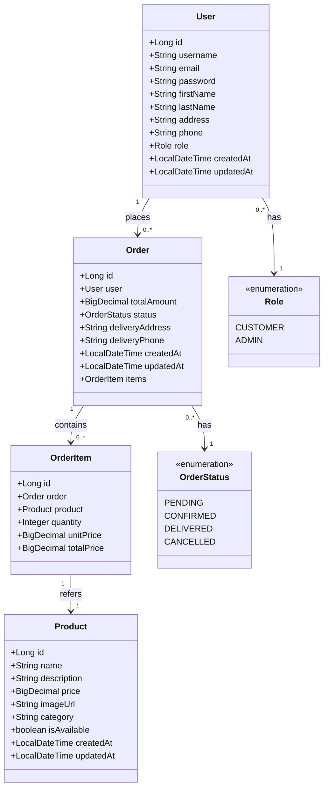

# Pizza Deliziosa Backend

This is the backend service for the Pizza Deliziosa web application, built with Spring Boot. This document provides a detailed explanation of the backend architecture, components, and functionality.

## Table of Contents
- [Architecture Overview](#architecture-overview)
- [Component Structure](#component-structure)
  - [Models](#models)
  - [Repositories](#repositories)
  - [DTOs](#dtos)
  - [Controllers](#controllers)
  - [Security](#security)
  - [Configuration](#configuration)
- [API Endpoints](#api-endpoints)
- [Authentication and Authorization](#authentication-and-authorization)
- [Database Schema](#database-schema)
- [Deployment Instructions](#deployment-instructions)

## Architecture Overview

The Pizza Deliziosa backend is built using Spring Boot, following a layered architecture pattern. It exposes a RESTful API that the Angular frontend consumes. The architecture consists of the following layers:

1. **Controller Layer**: Handles HTTP requests and responses
2. **Service Layer**: Contains business logic
3. **Repository Layer**: Manages data access operations
4. **Model Layer**: Defines data structures that map to database tables

The backend uses JWT (JSON Web Tokens) for authentication and maintains a PostgreSQL database for data persistence.

## Component Structure


### Models

The backend uses JPA entities to map Java objects to database tables:



- **User**: Represents application users (customers and administrators)
- **Product**: Pizza and other products available for purchase
- **Order**: Customer orders with delivery information and status
- **OrderItem**: Items within an order with quantities and prices
- **Role**: Enumeration of user roles (CUSTOMER, ADMIN)
- **OrderStatus**: Enumeration of order statuses (PENDING, CONFIRMED, DELIVERED, CANCELLED)

### Repositories

Repositories extend Spring Data JPA's `JpaRepository` interface, providing:

- Standard CRUD operations (Create, Read, Update, Delete)
- Custom query methods defined through method naming conventions
- Transaction management

Key repositories include:

- **UserRepository**: Manages user data, including authentication-related queries
- **ProductRepository**: Manages product data with filtering options
- **OrderRepository**: Manages order data with status and user filtering
- **MessageRepository**: Manages message data for customer support

### DTOs

Data Transfer Objects (DTOs) are used to:

1. Transfer data between the frontend and backend
2. Hide sensitive information (like passwords)
3. Shape responses to meet specific frontend needs
4. Validate incoming data

Key DTOs include:

- **AuthRequestDto**: Contains login credentials
- **AuthResponseDto**: Contains JWT token and user information
- **RegisterRequestDto**: Contains data for new user registration
- **ProductDto**: Simplified product representation
- **OrderDto**: Order information for API responses

### Controllers

Controllers handle HTTP requests and define the REST API endpoints:

- **AuthController**: Handles authentication and user registration
- **ProductController**: Manages product information
- **OrderController**: Processes and manages orders
- **UserController**: Manages user accounts
- **MessageController**: Handles customer support messages

### Security

The security layer implements:

1. **JWT-based Authentication**: Uses JSON Web Tokens for stateless authentication
2. **Role-based Authorization**: Controls access to endpoints based on user roles
3. **Password Encryption**: Secures user passwords using bcrypt
4. **CORS Configuration**: Controls which origins can access the API

The `JwtUtil` class provides methods for token generation, validation, and parsing.

### Configuration

Configuration classes set up:

- Database connection properties
- Security settings
- CORS policies
- Application behavior in different environments (development, production)

## API Endpoints

The backend provides several REST endpoints:

### Authentication
- `POST /api/auth/login`: Authenticate a user and receive a JWT token
- `POST /api/auth/register`: Register a new user account

### Products
- `GET /api/products`: Get all products
- `GET /api/products/{id}`: Get a specific product
- `POST /api/products`: Create a new product (admin only)
- `PUT /api/products/{id}`: Update a product (admin only)
- `DELETE /api/products/{id}`: Delete a product (admin only)

### Orders
- `GET /api/orders`: Get all orders (admin) or current user's orders (customer)
- `GET /api/orders/{id}`: Get a specific order
- `POST /api/orders`: Create a new order
- `PUT /api/orders/{id}/status`: Update an order's status (admin only)

### Users
- `GET /api/users`: Get all users (admin only)
- `GET /api/users/{id}`: Get a specific user
- `PUT /api/users/{id}`: Update user information

### Health Checks
- `GET /api/status`: Basic status check
- `GET /api/health`: Detailed health information

## Authentication and Authorization

The backend uses JWT (JSON Web Tokens) for authentication:

1. The client sends credentials to `/api/auth/login`
2. The server validates credentials and generates a JWT
3. The client stores the JWT and includes it in the Authorization header of subsequent requests
4. The server validates the JWT and identifies the user for each request

Authorization is role-based:
- Customers can view products, place orders, and manage their accounts
- Administrators can manage products, view all orders, update order statuses, and view user accounts

## Database Schema

The application uses a PostgreSQL database with tables that correspond to the model classes:

- `users`: Stores user account information
- `products`: Stores product information
- `orders`: Stores order information
- `order_items`: Stores items within orders
- `messages`: Stores customer support messages

## Deployment Instructions

### Running with Docker Compose

The easiest way to run the backend service is using Docker Compose, which will start both the Spring Boot application and a PostgreSQL database in containers.

### Prerequisites

- Docker and Docker Compose installed on your system
- Port 8080 available for the backend API
- Port 5431 available for PostgreSQL (mapped from internal 5432)

### Quick Start

#### Windows
Simply run the provided batch script:
```
run-docker.bat
```

#### Linux/macOS
Make the script executable and run it:
```
chmod +x run-docker.sh
./run-docker.sh
```

### Manual Steps

1. Navigate to the backend directory:
   ```
   cd /path/to/AngularWebshopPizza/backend
   ```

2. Build and start the containers:
   ```
   docker-compose up -d
   ```

3. The services will be available at:
   - Backend API: http://localhost:8080
   - PostgreSQL: localhost:5431 (username: postgres, password: postgres)

4. View logs:
   ```
   docker-compose logs -f
   ```

5. Stop the services:
   ```
   docker-compose down
   ```

### Verifying the Backend is Online

The backend provides two endpoints to check if it's running correctly:

1. **Basic Status Check**:
   ```
   http://localhost:8080/api/status
   ```
   This will return basic information including the current status, application name, and server time.

2. **Detailed Health Check**:
   ```
   http://localhost:8080/api/health
   ```
   This returns more detailed health information including JVM and OS details.

Both endpoints are publicly accessible without authentication, making them ideal for monitoring and status verification.

### Configuration

The PostgreSQL database is configured with:
- Database name: pizza_deliziosa
- Username: postgres
- Password: postgres
- External port: 5431 (mapped to internal 5432)

The Spring Boot application automatically connects to PostgreSQL using the docker profile settings.

### Persistence

The PostgreSQL data is persisted in a Docker volume called `postgres_data`. This ensures your data remains intact even when containers are removed.

To reset the database and start fresh:
```
docker-compose down -v
```

### Troubleshooting

If you encounter any issues:

1. Check that no other services are running on ports 8080 or 5431
2. Ensure Docker service is running
3. View container logs for detailed error messages:
   ```
   docker-compose logs backend
   docker-compose logs postgres
   ```
4. Check the status endpoints to verify the application is running correctly

### Development Without Docker

If you prefer to run the application without Docker:

1. Install PostgreSQL on your local machine and create a database called `pizza_deliziosa`
2. Update `src/main/resources/application.properties` if your PostgreSQL is not running on the default port
3. Run the application using:
   ```
   ./mvnw spring-boot:run
   ``` 