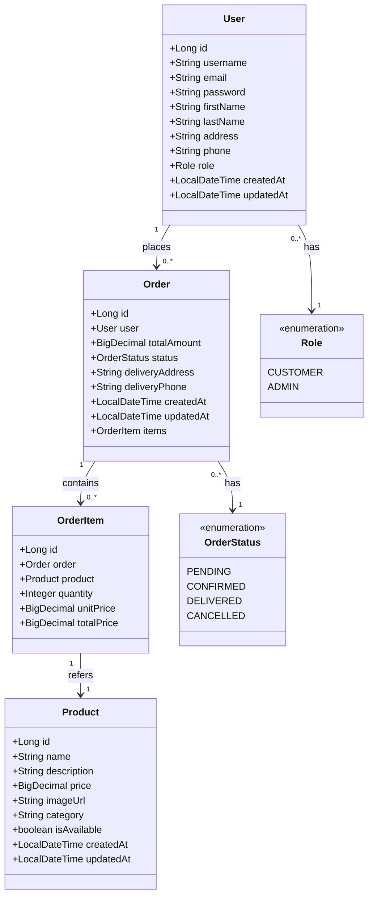

# Pizza Deliziosa Backend

This is the backend service for the Pizza Deliziosa web application, built with Spring Boot. This document provides a detailed explanation of the backend architecture, components, and functionality with specific code references.

## Table of Contents
- [Architecture Overview](#architecture-overview)
- [Component Structure](#component-structure)
  - [Models](#models)
  - [Repositories](#repositories)
  - [DTOs](#dtos)
  - [Controllers](#controllers)
  - [Security](#security)
  - [Configuration](#configuration)
- [API Endpoints](#api-endpoints)
- [Authentication and Authorization](#authentication-and-authorization)
- [Database Schema](#database-schema)
- [Deployment Instructions](#deployment-instructions)

## Architecture Overview

The Pizza Deliziosa backend is built using [Spring Boot](https://spring.io/projects/spring-boot) (version 2.7.x), following a layered architecture pattern. It exposes a RESTful API that the Angular frontend consumes. The architecture consists of the following layers:

1. **Controller Layer** (`com.pizza.controller.*`): Handles HTTP requests and responses, defining API endpoints.
2. **Service Layer** (implicit through controllers): Contains business logic for operations.
3. **Repository Layer** (`com.pizza.repository.*`): Manages data access operations using Spring Data JPA.
4. **Model Layer** (`com.pizza.model.*`): Defines data structures that map to database tables.

The backend uses [JSON Web Tokens (JWT)](https://jwt.io/introduction/) for authentication, implemented in `com.pizza.security.JwtUtil`, and maintains a PostgreSQL database for data persistence.

### Key Technologies

- **Spring Boot**: Framework for building Java applications with minimal configuration
- **Spring Data JPA**: Data access framework with Hibernate as the ORM provider
- **Spring Security**: Authentication and authorization framework 
- **PostgreSQL**: Relational database for data persistence
- **JWT**: Stateless authentication mechanism
- **Maven**: Dependency management and build tool

For implementation details, refer to the main application class [PizzaWebshopApplication.java](src/main/java/com/pizza/PizzaWebshopApplication.java), which bootstraps the Spring Boot application.

## Component Structure

```mermaid
classDiagram
    class AuthController {
        +login(AuthRequestDto request) AuthResponseDto
        +register(RegisterRequestDto request) ResponseEntity
    }
    
    class HomeController {
        +index() String
        +about() String
    }
    
    class ProductController {
        +getAllProducts() List~Product~
        +getProduct(Long id) Product
        +createProduct(Product product) Product
        +updateProduct(Long id, Product product) Product
        +deleteProduct(Long id) void
    }
    
    class OrderController {
        +getAllOrders() List~Order~
        +getOrder(Long id) Order
        +createOrder(Order order) Order
        +updateOrderStatus(Long id, String status) Order
    }
    
    class UserController {
        +getAllUsers() List~User~
        +getUser(Long id) User
        +updateUser(Long id, User user) User
    }
    
    class MessageController {
        +getAllMessages() List~Message~
        +createMessage(Message message) Message
    }
    
    class JpaRepository~T,ID~ {
        <<interface>>
        +findAll() List~T~
        +findById(ID id) Optional~T~
        +save(T entity) T
        +delete(T entity) void
        +count() long
    }
    
    class UserRepository {
        <<interface>>
        +findByUsername(String username) Optional~User~
        +findByEmail(String email) Optional~User~
        +existsByUsername(String username) boolean
    }
    
    class ProductRepository {
        <<interface>>
        +findByAvailable(boolean available) List~Product~
        +findByNameContaining(String name) List~Product~
    }
    
    class OrderRepository {
        <<interface>>
        +findByUser(User user) List~Order~
        +findByStatus(String status) List~Order~
    }
    
    class MessageRepository {
        <<interface>>
        +findBySender(User sender) List~Message~
        +findByTimestampAfter(LocalDateTime timestamp) List~Message~
    }
    
    class JwtUtil {
        +generateToken(UserDetails userDetails) String
        +extractUsername(String token) String
        +validateToken(String token, UserDetails userDetails) boolean
    }
    
    AuthController --> UserRepository : uses
    AuthController --> JwtUtil : uses
    ProductController --> ProductRepository : uses
    OrderController --> OrderRepository : uses
    UserController --> UserRepository : uses
    MessageController --> MessageRepository : uses
    
    JpaRepository <|-- UserRepository : extends
    JpaRepository <|-- ProductRepository : extends
    JpaRepository <|-- OrderRepository : extends
    JpaRepository <|-- MessageRepository : extends
```



### Models

The backend uses [JPA entities](https://docs.oracle.com/javaee/7/tutorial/persistence-intro.htm) to map Java objects to database tables. These classes include annotations like `@Entity`, `@Table`, and relationship mappings (`@OneToMany`, `@ManyToOne`, etc.). The model classes are defined in the `com.pizza.model` package.



Key model classes:

- **[User.java](src/main/java/com/pizza/model/User.java)**: Represents application users with roles
  ```java
  @Entity
  @Table(name = "users")
  public class User {
      @Id
      @GeneratedValue(strategy = GenerationType.IDENTITY)
      private Long id;
      
      @Column(unique = true, nullable = false)
      private String username;
      
      @Column(unique = true, nullable = false)
      private String email;
      
      @Column(nullable = false)
      private String password;
      
      // Other fields and relationships...
      
      @Enumerated(EnumType.STRING)
      private Role role;
  }
  ```

- **[Product.java](src/main/java/com/pizza/model/Product.java)**: Pizza and other products available for purchase
- **[Order.java](src/main/java/com/pizza/model/Order.java)**: Customer orders with delivery information and status
- **[OrderItem.java](src/main/java/com/pizza/model/OrderItem.java)**: Items within an order with quantities and prices
- **[Role.java](src/main/java/com/pizza/model/Role.java)**: Enumeration of user roles (CUSTOMER, ADMIN)
  ```java
  public enum Role {
      CUSTOMER, ADMIN
  }
  ```
- **[OrderStatus.java](src/main/java/com/pizza/model/OrderStatus.java)**: Enumeration of order statuses

### Repositories

Repositories extend Spring Data JPA's [`JpaRepository`](https://docs.spring.io/spring-data/jpa/docs/current/api/org/springframework/data/jpa/repository/JpaRepository.html) interface, providing:

- Standard CRUD operations (Create, Read, Update, Delete)
- Custom query methods defined through [method naming conventions](https://docs.spring.io/spring-data/jpa/docs/current/reference/html/#repositories.query-methods.query-creation)
- Transaction management handled by Spring

Key repositories in `com.pizza.repository`:

- **[UserRepository.java](src/main/java/com/pizza/repository/UserRepository.java)**: Manages user data
  ```java
  @Repository
  public interface UserRepository extends JpaRepository<User, Long> {
      Optional<User> findByUsername(String username);
      Optional<User> findByEmail(String email);
      boolean existsByUsername(String username);
      boolean existsByEmail(String email);
  }
  ```

- **[ProductRepository.java](src/main/java/com/pizza/repository/ProductRepository.java)**: Manages product data
  ```java
  @Repository
  public interface ProductRepository extends JpaRepository<Product, Long> {
      List<Product> findByAvailable(boolean available);
      List<Product> findByNameContaining(String name);
  }
  ```

- **[OrderRepository.java](src/main/java/com/pizza/repository/OrderRepository.java)**: Manages order data
- **[MessageRepository.java](src/main/java/com/pizza/repository/MessageRepository.java)**: Manages message data

Spring Data JPA automatically generates implementations of these interfaces at runtime, providing methods to perform database operations without writing explicit SQL queries.

### DTOs

Data Transfer Objects (DTOs) located in `com.pizza.dto` are used to:

1. Transfer data between the frontend and backend
2. Hide sensitive information (like passwords)
3. Shape responses to meet specific frontend needs
4. Validate incoming data using [Bean Validation](https://beanvalidation.org/)

Key DTOs include:

- **[AuthRequestDto.java](src/main/java/com/pizza/dto/AuthRequestDto.java)**: Contains login credentials
  ```java
  public class AuthRequestDto {
      @NotBlank
      private String username;
      
      @NotBlank
      private String password;
      
      // getters, setters
  }
  ```

- **[AuthResponseDto.java](src/main/java/com/pizza/dto/AuthResponseDto.java)**: Contains JWT token and user information
  ```java
  @Builder
  public class AuthResponseDto {
      private String token;
      private Long id;
      private String username;
      private String role;
      
      // getters, setters
  }
  ```

- **[RegisterRequestDto.java](src/main/java/com/pizza/dto/RegisterRequestDto.java)**: Contains data for new user registration
- **[OrderRequestDto.java](src/main/java/com/pizza/dto/OrderRequestDto.java)**: Order data for creating/updating orders
- **[OrderResponseDto.java](src/main/java/com/pizza/dto/OrderResponseDto.java)**: Order information for API responses

### Controllers

Controllers are annotated with `@RestController` and handle HTTP requests. They define the REST API endpoints and are located in `com.pizza.controller`:

- **[AuthController.java](src/main/java/com/pizza/controller/AuthController.java)**: Handles authentication and user registration
  ```java
  @RestController
  @RequestMapping("/api/auth")
  public class AuthController {
      @PostMapping("/login")
      public ResponseEntity<?> login(@RequestBody AuthRequestDto authRequest) {
          // Authentication logic
          Authentication authentication = authenticationManager.authenticate(
                  new UsernamePasswordAuthenticationToken(
                          authRequest.getUsername(), 
                          authRequest.getPassword()
                  )
          );
          
          // Generate JWT token
          final UserDetails userDetails = userDetailsService.loadUserByUsername(authRequest.getUsername());
          final String jwt = jwtUtil.generateToken(userDetails);
          
          // Return response with token
          return ResponseEntity.ok(AuthResponseDto.builder()
                  .token(jwt)
                  .id(user.getId())
                  .username(user.getUsername())
                  .role(user.getRole().name())
                  .build());
      }
      
      @PostMapping("/register")
      public ResponseEntity<?> register(@RequestBody RegisterRequestDto registerRequest) {
          // Registration logic
      }
  }
  ```

- **[ProductController.java](src/main/java/com/pizza/controller/ProductController.java)**: Manages product information
  ```java
  @RestController
  @RequestMapping("/api/products")
  public class ProductController {
      @GetMapping
      public List<Product> getAllProducts() {
          return productRepository.findAll();
      }
      
      @GetMapping("/{id}")
      public ResponseEntity<Product> getProduct(@PathVariable Long id) {
          // Get product by ID
      }
      
      // Other CRUD operations
  }
  ```

- **[OrderController.java](src/main/java/com/pizza/controller/OrderController.java)**: Processes and manages orders
- **[UserController.java](src/main/java/com/pizza/controller/UserController.java)**: Manages user accounts
- **[MessageController.java](src/main/java/com/pizza/controller/MessageController.java)**: Handles customer support messages
- **[HealthStatusController.java](src/main/java/com/pizza/controller/HealthStatusController.java)**: Provides application health/status information

### Security

The security layer is configured in `com.pizza.config.SecurityConfig` and implements:

1. **JWT-based Authentication**: Uses JSON Web Tokens for stateless authentication
   - Key classes: `JwtUtil.java`, `JwtRequestFilter.java`

2. **Role-based Authorization**: Controls access to endpoints based on user roles
   - Configured in `SecurityConfig.java` with different access rules for different endpoints
   
3. **Password Encryption**: Secures user passwords using bcrypt
   - Configured in `SecurityConfig.java` with `PasswordEncoder` bean

4. **CORS Configuration**: Controls which origins can access the API
   - Configured in `SecurityConfig.java` with `CorsConfigurationSource` bean

The JWT implementation is in `com.pizza.security.JwtUtil`:

```java
@Component
public class JwtUtil {
    @Value("${jwt.secret:your-very-long-secret-string-at-least-32-characters-long}")
    private String secretString;
    
    @Value("${jwt.expiration:86400000}") // 1 day in milliseconds
    private long expirationTime;
    
    public String generateToken(UserDetails userDetails) {
        Map<String, Object> claims = new HashMap<>();
        claims.put("authorities", userDetails.getAuthorities()
                .stream()
                .map(authority -> authority.getAuthority())
                .toList());
        
        return createToken(claims, userDetails.getUsername());
    }
    
    private String createToken(Map<String, Object> claims, String subject) {
        return Jwts.builder()
                .setClaims(claims)
                .setSubject(subject)
                .setIssuedAt(new Date(System.currentTimeMillis()))
                .setExpiration(new Date(System.currentTimeMillis() + expirationTime))
                .signWith(getSigningKey(), SignatureAlgorithm.HS256)
                .compact();
    }
    
    // Other methods for token validation and parsing
}
```

Further reading on Spring Security:
- [Spring Security Reference](https://docs.spring.io/spring-security/reference/index.html)
- [JWT Authentication Tutorial](https://www.bezkoder.com/spring-boot-jwt-authentication/)

### Configuration

Configuration classes set up:

- **[SecurityConfig.java](src/main/java/com/pizza/config/SecurityConfig.java)**: Security configuration
  ```java
  @Configuration
  @EnableWebSecurity
  public class SecurityConfig extends WebSecurityConfigurerAdapter {
      @Override
      protected void configure(HttpSecurity http) throws Exception {
          http.csrf().disable()
              .authorizeRequests()
              .antMatchers("/api/auth/**", "/api/status", "/api/health").permitAll()
              .antMatchers(HttpMethod.GET, "/api/products/**").permitAll()
              .antMatchers("/api/admin/**").hasRole("ADMIN")
              .anyRequest().authenticated()
              .and()
              .sessionManagement().sessionCreationPolicy(SessionCreationPolicy.STATELESS);
              
          http.addFilterBefore(jwtRequestFilter, UsernamePasswordAuthenticationFilter.class);
      }
      
      // Other configuration methods
  }
  ```

- **Database connection properties**: Defined in `application.properties` or `application.yml`
- **CORS policies**: Configured in `SecurityConfig.java`
- **Environment profiles**: Different settings for development vs production

## API Endpoints

The backend provides several REST endpoints:

### Authentication Endpoints
- `POST /api/auth/login`: Authenticate a user and receive a JWT token
  - Implemented in `AuthController.login()`
  - Request body: `AuthRequestDto` with username and password
  - Response: `AuthResponseDto` with JWT token and user details

- `POST /api/auth/register`: Register a new user account
  - Implemented in `AuthController.register()`
  - Request body: `RegisterRequestDto` with user details
  - Response: Success message or error

### Product Endpoints
- `GET /api/products`: Get all products
  - Implemented in `ProductController.getAllProducts()`
  - Response: List of `Product` objects

- `GET /api/products/{id}`: Get a specific product
  - Implemented in `ProductController.getProduct()`
  - Path variable: Product ID
  - Response: Single `Product` object

- `POST /api/products`: Create a new product (admin only)
  - Implemented in `ProductController.createProduct()`
  - Request body: `Product` object
  - Response: Newly created `Product`

- `PUT /api/products/{id}`: Update a product (admin only)
  - Implemented in `ProductController.updateProduct()`
  - Path variable: Product ID
  - Request body: Updated `Product`
  - Response: Updated `Product` object

- `DELETE /api/products/{id}`: Delete a product (admin only)
  - Implemented in `ProductController.deleteProduct()`
  - Path variable: Product ID
  - Response: Success status code

### Order Endpoints
- `GET /api/orders`: Get all orders (admin) or current user's orders (customer)
  - Implemented in `OrderController.getAllOrders()`
  - Response: List of `Order` objects

- `GET /api/orders/{id}`: Get a specific order
  - Implemented in `OrderController.getOrder()`
  - Path variable: Order ID
  - Response: Single `Order` object

- `POST /api/orders`: Create a new order
  - Implemented in `OrderController.createOrder()`
  - Request body: `OrderRequestDto`
  - Response: Created `Order` object

- `PUT /api/orders/{id}/status`: Update an order's status (admin only)
  - Implemented in `OrderController.updateOrderStatus()`
  - Path variable: Order ID
  - Request body: New status
  - Response: Updated `Order` object

### User Endpoints
- `GET /api/users`: Get all users (admin only)
  - Implemented in `UserController.getAllUsers()`
  - Response: List of `User` objects

- `GET /api/users/{id}`: Get a specific user
  - Implemented in `UserController.getUser()`
  - Path variable: User ID
  - Response: Single `User` object

- `PUT /api/users/{id}`: Update user information
  - Implemented in `UserController.updateUser()`
  - Path variable: User ID
  - Request body: Updated `User` object
  - Response: Updated `User` object

### Health/Status Endpoints
- `GET /api/status`: Basic status check
  - Implemented in `HealthStatusController.getStatus()`
  - Response: String with basic status information

- `GET /api/health`: Detailed health information
  - Implemented in `HealthStatusController.getHealth()`
  - Response: JSON with detailed health metrics

## Authentication and Authorization

The backend uses JWT (JSON Web Tokens) for authentication. The process is implemented in the following files:

1. **[AuthController.java](src/main/java/com/pizza/controller/AuthController.java)**: Handles login and token generation
2. **[JwtUtil.java](src/main/java/com/pizza/security/JwtUtil.java)**: Generates and validates JWT tokens
3. **[JwtRequestFilter.java](src/main/java/com/pizza/security/JwtRequestFilter.java)**: Intercepts requests to validate tokens
4. **[SecurityConfig.java](src/main/java/com/pizza/config/SecurityConfig.java)**: Configures security rules

### Authentication Flow

1. **Client Authentication**: 
   - Client sends credentials to `/api/auth/login` endpoint in `AuthController.java`
   - `AuthController` uses Spring's `AuthenticationManager` to validate credentials

2. **Token Generation**:
   - After successful authentication, `UserDetailsService` loads user details
   - `JwtUtil.generateToken()` creates a JWT with user information and expiration
   - Token is returned to the client in `AuthResponseDto`

3. **Token Validation**:
   - For subsequent requests, the client includes the JWT in the Authorization header
   - `JwtRequestFilter` extracts and validates the token using `JwtUtil.validateToken()`
   - If valid, the filter sets the authentication in Spring's `SecurityContext`

4. **Authorization**:
   - Security rules in `SecurityConfig.java` determine if the authenticated user has permission for the requested resource
   - Based on user roles (CUSTOMER, ADMIN) defined in the `User` entity

Authorization is role-based:
- Customers can view products, place orders, and manage their accounts
- Administrators can manage products, view all orders, update order statuses, and view user accounts

For deeper understanding of JWT, see:
- [Introduction to JSON Web Tokens](https://jwt.io/introduction/)
- [JWT Authentication in Spring Security](https://www.toptal.com/spring/spring-security-tutorial)

## Database Schema

The application uses a PostgreSQL database with tables that correspond to the model classes:

- `users`: Stores user account information
  - Defined by `User.java` entity with `@Table(name = "users")`
  - Contains authentication details and personal information

- `products`: Stores product information
  - Defined by `Product.java` entity
  - Contains pizza details, prices, and availability

- `orders`: Stores order information
  - Defined by `Order.java` entity
  - Contains order status, delivery information, and user reference

- `order_items`: Stores items within orders
  - Defined by `OrderItem.java` entity
  - Contains product references, quantities, and prices

- `messages`: Stores customer support messages
  - Defined by `Message.java` entity
  - Contains message content and sender information

The schema is automatically created by Hibernate based on JPA annotations in the model classes, using the `spring.jpa.hibernate.ddl-auto` property in `application.properties`.

## Deployment Instructions

### Running with Docker Compose

The easiest way to run the backend service is using Docker Compose, which will start both the Spring Boot application and a PostgreSQL database in containers.

### Prerequisites

- Docker and Docker Compose installed on your system
- Port 8080 available for the backend API
- Port 5431 available for PostgreSQL (mapped from internal 5432)

### Quick Start

#### Windows
Simply run the provided batch script:
```
run-docker.bat
```

#### Linux/macOS
Make the script executable and run it:
```
chmod +x run-docker.sh
./run-docker.sh
```

### Manual Steps

1. Navigate to the backend directory:
   ```
   cd /path/to/AngularWebshopPizza/backend
   ```

2. Build and start the containers:
   ```
   docker-compose up -d
   ```

3. The services will be available at:
   - Backend API: http://localhost:8080
   - PostgreSQL: localhost:5431 (username: postgres, password: postgres)

4. View logs:
   ```
   docker-compose logs -f
   ```

5. Stop the services:
   ```
   docker-compose down
   ```

### Verifying the Backend is Online

The backend provides two endpoints to check if it's running correctly:

1. **Basic Status Check**:
   ```
   http://localhost:8080/api/status
   ```
   This will return basic information including the current status, application name, and server time.

2. **Detailed Health Check**:
   ```
   http://localhost:8080/api/health
   ```
   This returns more detailed health information including JVM and OS details.

Both endpoints are publicly accessible without authentication, making them ideal for monitoring and status verification.

### Configuration

The PostgreSQL database is configured with:
- Database name: pizza_deliziosa
- Username: postgres
- Password: postgres
- External port: 5431 (mapped to internal 5432)

The Spring Boot application automatically connects to PostgreSQL using the docker profile settings.

### Persistence

The PostgreSQL data is persisted in a Docker volume called `postgres_data`. This ensures your data remains intact even when containers are removed.

To reset the database and start fresh:
```
docker-compose down -v
```

### Troubleshooting

If you encounter any issues:

1. Check that no other services are running on ports 8080 or 5431
2. Ensure Docker service is running
3. View container logs for detailed error messages:
   ```
   docker-compose logs backend
   docker-compose logs postgres
   ```
4. Check the status endpoints to verify the application is running correctly

### Development Without Docker

If you prefer to run the application without Docker:

1. Install PostgreSQL on your local machine and create a database called `pizza_deliziosa`
2. Update `src/main/resources/application.properties` if your PostgreSQL is not running on the default port
3. Run the application using:
   ```
   ./mvnw spring-boot:run
   ```

### Further Reading

For a deeper understanding of the technologies used:
- [Spring Boot Documentation](https://docs.spring.io/spring-boot/docs/current/reference/html/index.html)
- [Spring Data JPA Documentation](https://docs.spring.io/spring-data/jpa/docs/current/reference/html/#reference)
- [Hibernate ORM Documentation](https://hibernate.org/orm/documentation/5.4/)
- [PostgreSQL Documentation](https://www.postgresql.org/docs/)
- [Docker Documentation](https://docs.docker.com/) 