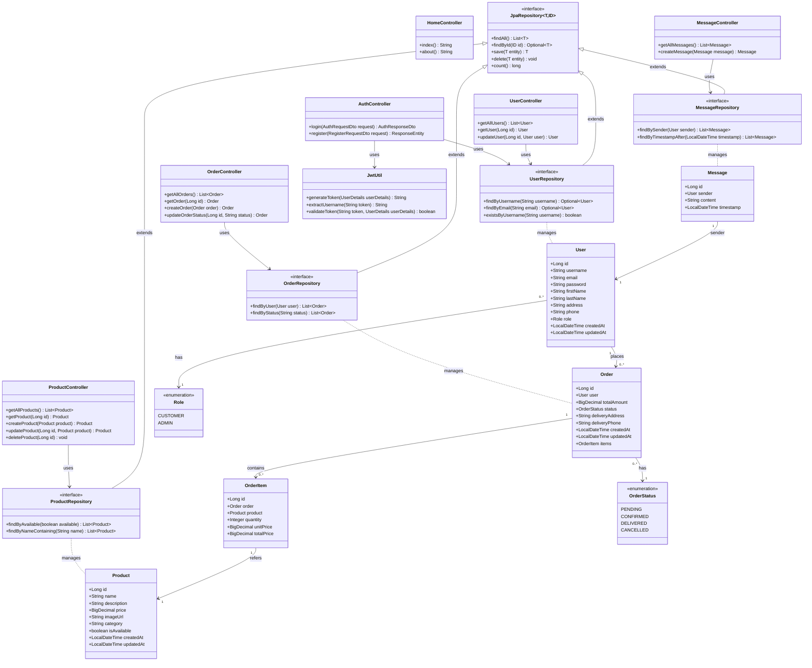

```mermaid
classDiagram
    class AuthController {
        +login(AuthRequestDto request) AuthResponseDto
        +register(RegisterRequestDto request) ResponseEntity
    }
    
    class HomeController {
        +index() String
        +about() String
    }
    
    class ProductController {
        +getAllProducts() List~Product~
        +getProduct(Long id) Product
        +createProduct(Product product) Product
        +updateProduct(Long id, Product product) Product
        +deleteProduct(Long id) void
    }
    
    class OrderController {
        +getAllOrders() List~Order~
        +getOrder(Long id) Order
        +createOrder(Order order) Order
        +updateOrderStatus(Long id, String status) Order
    }
    
    class UserController {
        +getAllUsers() List~User~
        +getUser(Long id) User
        +updateUser(Long id, User user) User
    }
    
    class MessageController {
        +getAllMessages() List~Message~
        +createMessage(Message message) Message
    }
    
    class JpaRepository~T,ID~ {
        <<interface>>
        +findAll() List~T~
        +findById(ID id) Optional~T~
        +save(T entity) T
        +delete(T entity) void
        +count() long
    }
    
    class UserRepository {
        <<interface>>
        +findByUsername(String username) Optional~User~
        +findByEmail(String email) Optional~User~
        +existsByUsername(String username) boolean
    }
    
    class ProductRepository {
        <<interface>>
        +findByAvailable(boolean available) List~Product~
        +findByNameContaining(String name) List~Product~
    }
    
    class OrderRepository {
        <<interface>>
        +findByUser(User user) List~Order~
        +findByStatus(String status) List~Order~
    }
    
    class MessageRepository {
        <<interface>>
        +findBySender(User sender) List~Message~
        +findByTimestampAfter(LocalDateTime timestamp) List~Message~
    }
    
    class JwtUtil {
        +generateToken(UserDetails userDetails) String
        +extractUsername(String token) String
        +validateToken(String token, UserDetails userDetails) boolean
    }
    
    class User {
        +Long id
        +String username
        +String email
        +String password
        +String firstName
        +String lastName
        +String address
        +String phone
        +Role role
        +LocalDateTime createdAt
        +LocalDateTime updatedAt
    }

    class Product {
        +Long id
        +String name
        +String description
        +BigDecimal price
        +String imageUrl
        +String category
        +boolean isAvailable
        +LocalDateTime createdAt
        +LocalDateTime updatedAt
    }

    class Order {
        +Long id
        +User user
        +BigDecimal totalAmount
        +OrderStatus status
        +String deliveryAddress
        +String deliveryPhone
        +LocalDateTime createdAt
        +LocalDateTime updatedAt
        +OrderItem items
    }

    class OrderItem {
        +Long id
        +Order order
        +Product product
        +Integer quantity
        +BigDecimal unitPrice
        +BigDecimal totalPrice
    }

    class Message {
        +Long id
        +User sender
        +String content
        +LocalDateTime timestamp
    }

    class Role {
        <<enumeration>>
        CUSTOMER
        ADMIN
    }

    class OrderStatus {
        <<enumeration>>
        PENDING
        CONFIRMED
        DELIVERED
        CANCELLED
    }

    AuthController --> UserRepository : uses
    AuthController --> JwtUtil : uses
    ProductController --> ProductRepository : uses
    OrderController --> OrderRepository : uses
    UserController --> UserRepository : uses
    MessageController --> MessageRepository : uses
    
    JpaRepository <|-- UserRepository : extends
    JpaRepository <|-- ProductRepository : extends
    JpaRepository <|-- OrderRepository : extends
    JpaRepository <|-- MessageRepository : extends
    
    UserRepository .. User : manages
    ProductRepository .. Product : manages
    OrderRepository .. Order : manages
    MessageRepository .. Message : manages

    User "1" --> "0..*" Order : places
    User "0..*" --> "1" Role : has
    Order "1" --> "0..*" OrderItem : contains
    Order "0..*" --> "1" OrderStatus : has
    OrderItem "1" --> "1" Product : refers
    Message "1" --> "1" User : sender
```
